# COVID-19 Named Entity Recognition

[Back to Home](../../../README.md).

Associated with The Hong Kong University of Science and Technology.

Oct. 2020 ~ Dec. 2020

This was a course project from COMP4901K Machine Learning for Natural Language Processing at HKUST. It aimed to find and train a model to perform the NER labeling task for a COVID-19 related corpus. After testing with simple NNs and several kinds of RNNs, a bi-directional GRU network with a preceding embedding layer, which had a relatively huge dimension, was chosen to conduct the NER task. The resulting accuracy on the validation set was around 0.9049.

## Report

[Report](./assets/Report.pdf)

## Slide

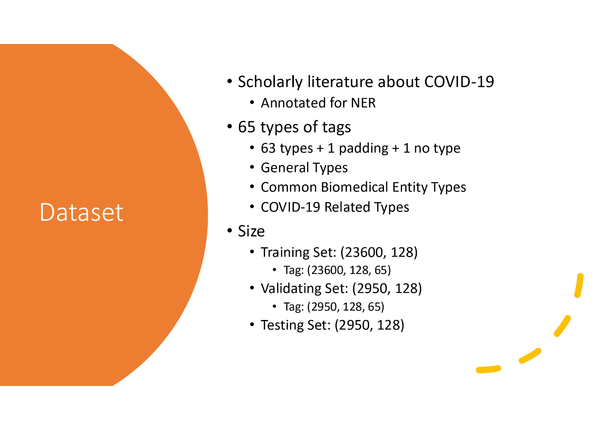

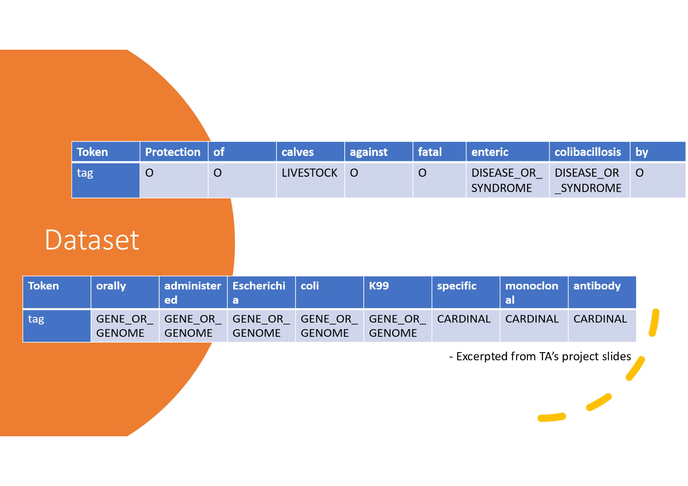

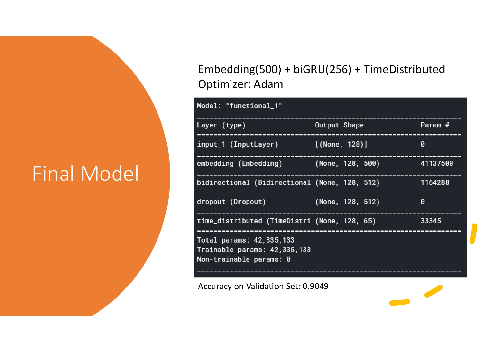

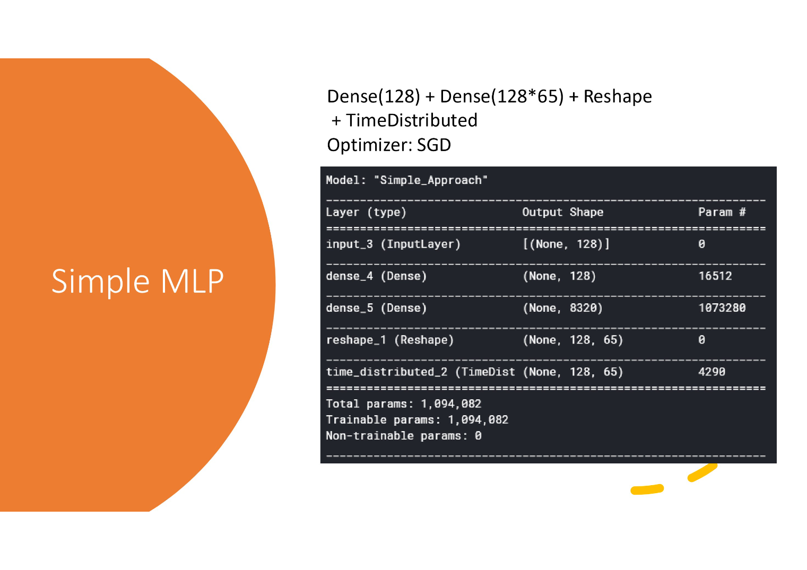

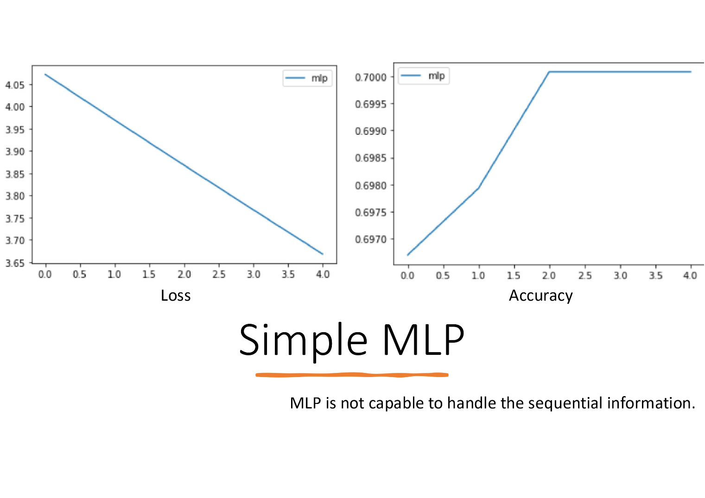

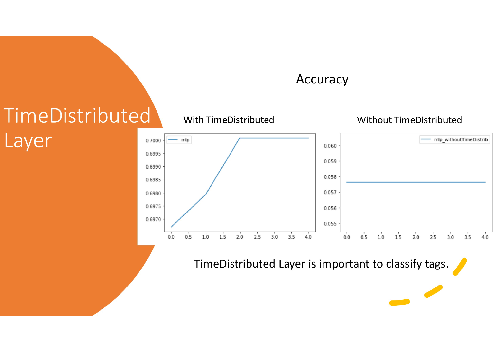

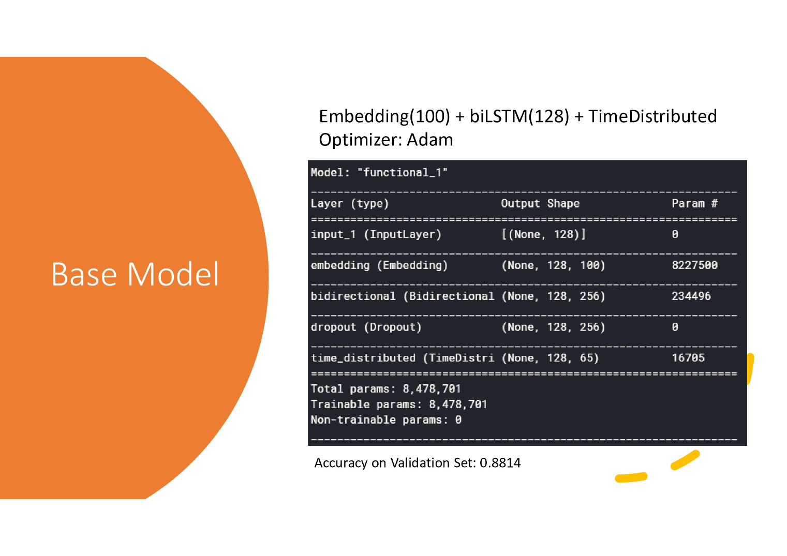

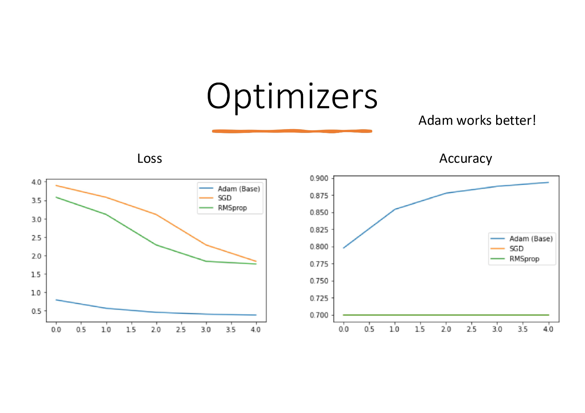

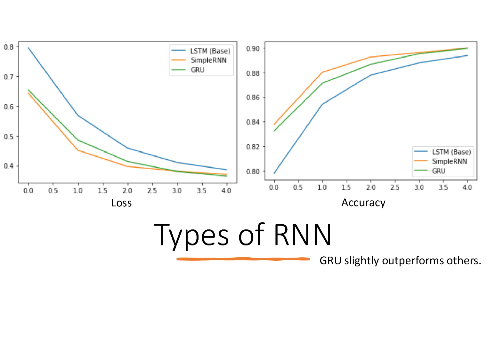

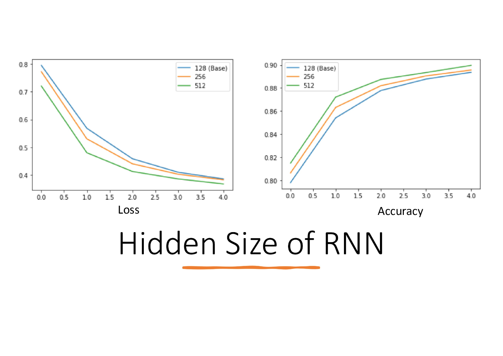

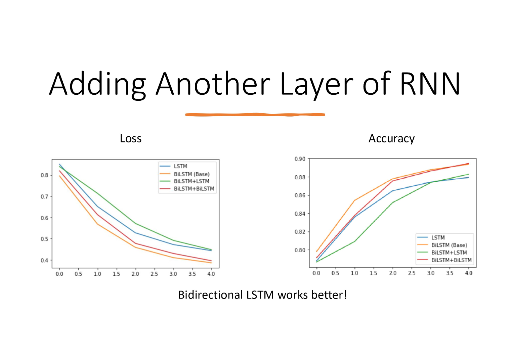

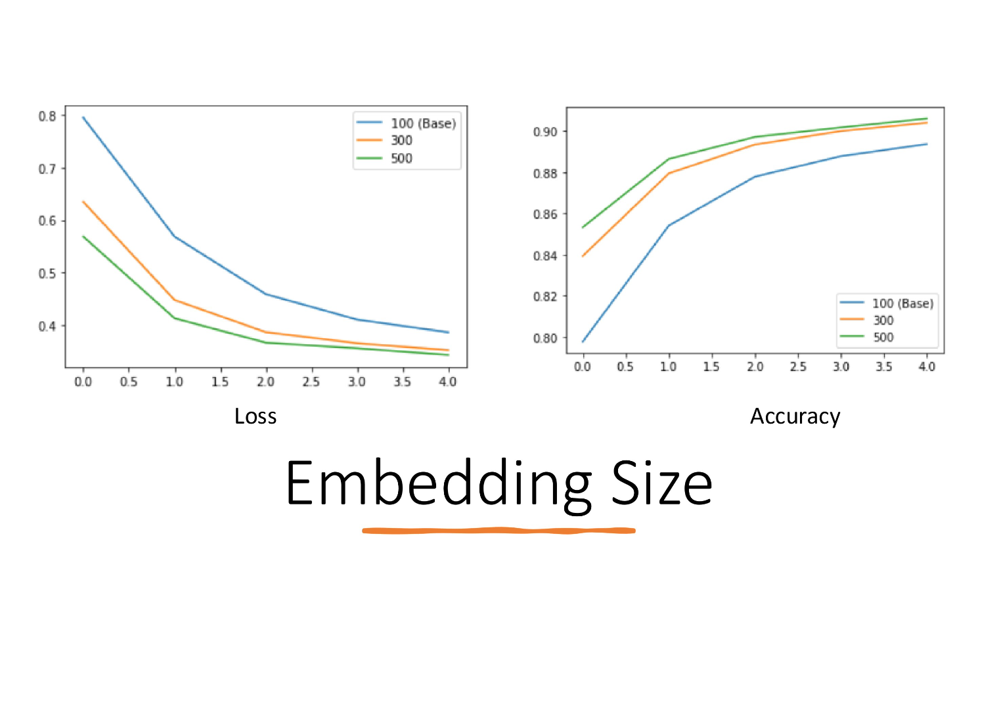

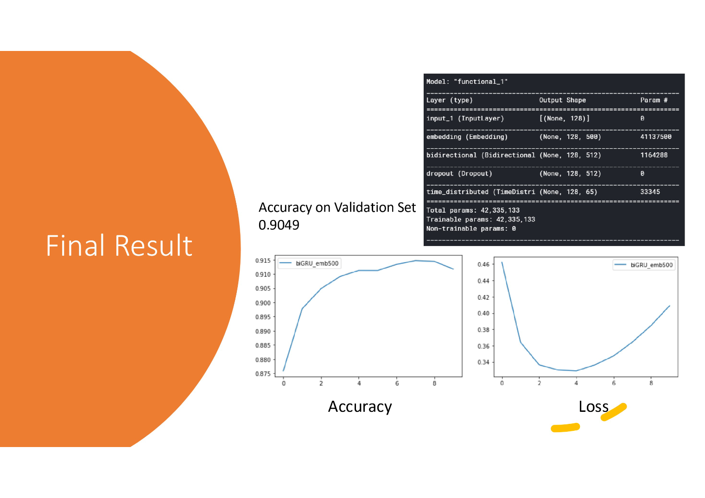

## Code

[Code](./assets/Advance9_Covid19_NER.ipynb)
