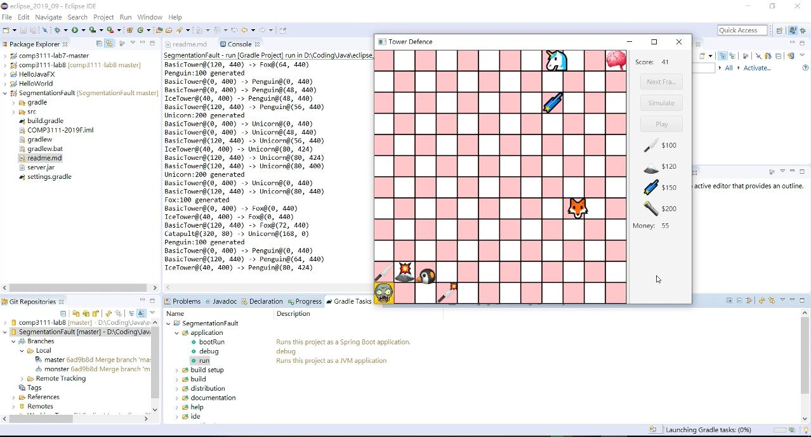
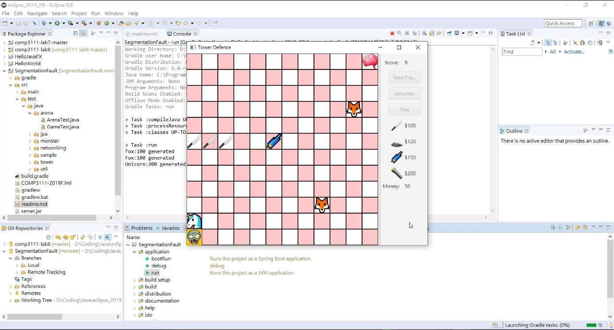
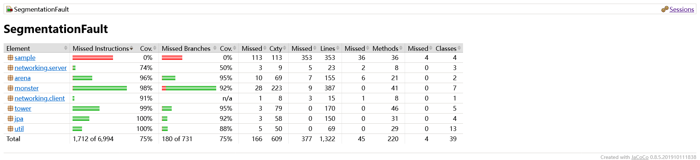
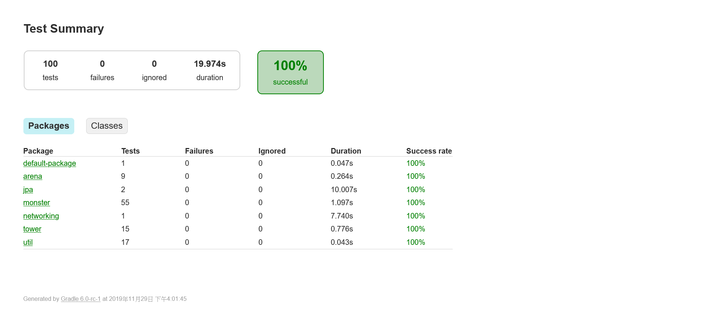
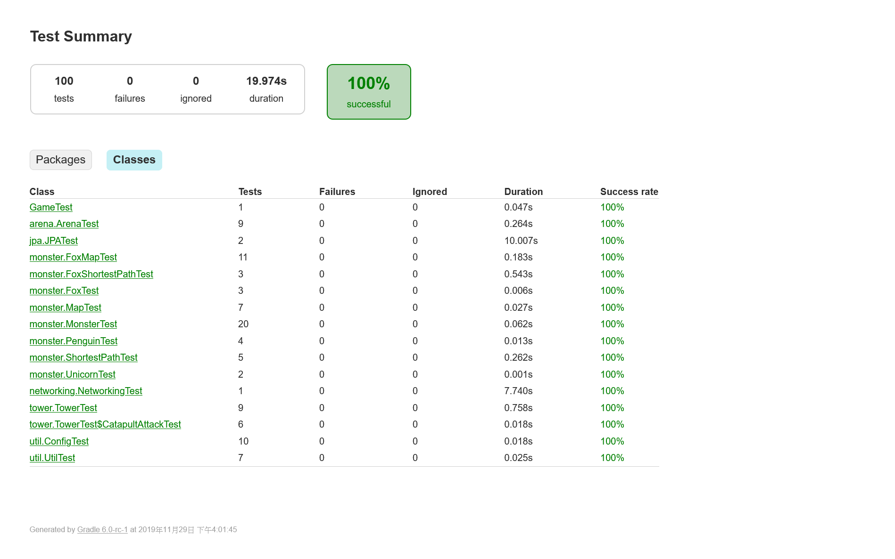
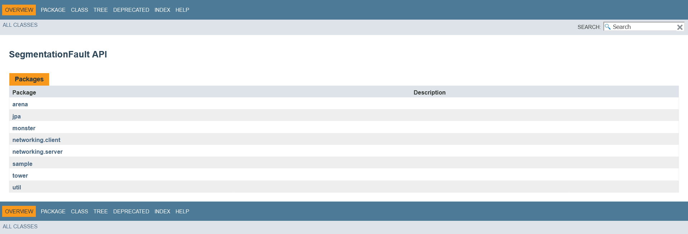
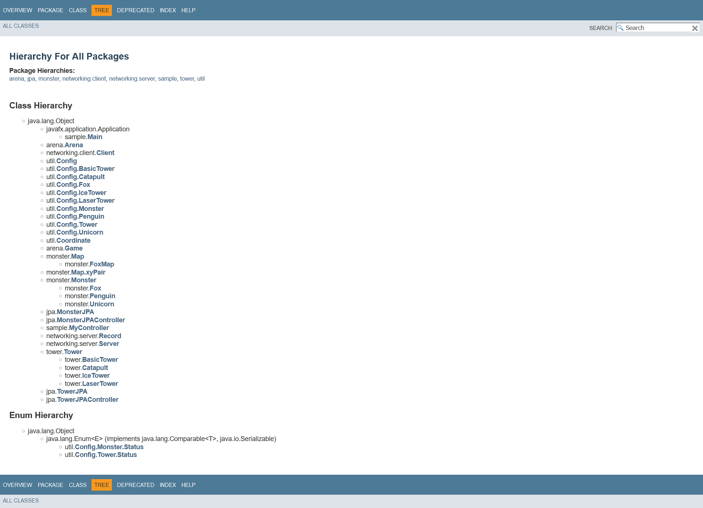
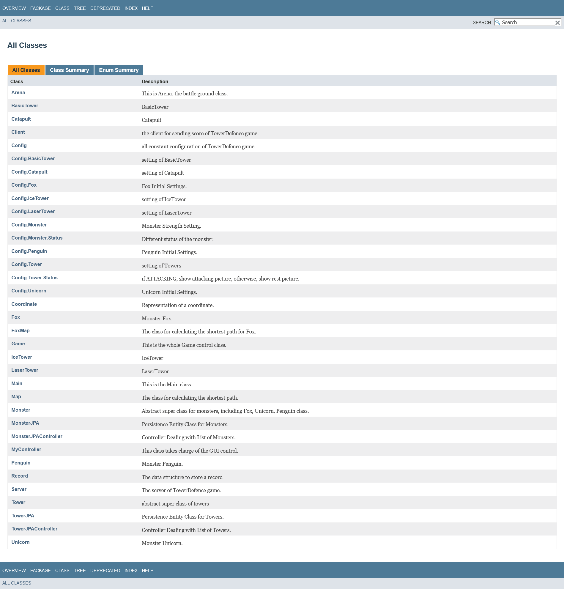

# Tower Defense

[Back to Home](../../../README.md).

Associated with The Hong Kong University of Science and Technology.

Sep. 2019 ~ Dec. 2019

This was a course project from COMP3111H Honors Software Engineering at HKUST. We built an interesting window game called Tower Defense which reproduced the popular game genre as it was named. It was built with Java, and we utilized JavaFX for GUI, Timer class (java.util.Timer) for defining and changing the time frame of the game flow, Hibernate for persistence (JPA, data storage) toward MySQL database, and Spring Boot for the remote server service. We also utilized JUnit for unit testing.

## Team Members

- Team Name: SegmentationFault
- Members
  - CHEN, Xinyi
  - HUANG, Jiaxin
  - LIN, Ching-Yu

## Screenshots

## Tests and Documents

We separated the workload and functionalities by defining packages and the expected behaviors of APIs for interactions between packages. We conducted unit testing on this project to ensure the APIs of each package and internal methods of packages were working as expected. We also included test coverage metrics to confirm that important methods were not neglected. Documentation was also performed to provide information on each method.

### Test Coverage

Jacoco Test Report

### Unit Tests

### Documents

JavaDoc

