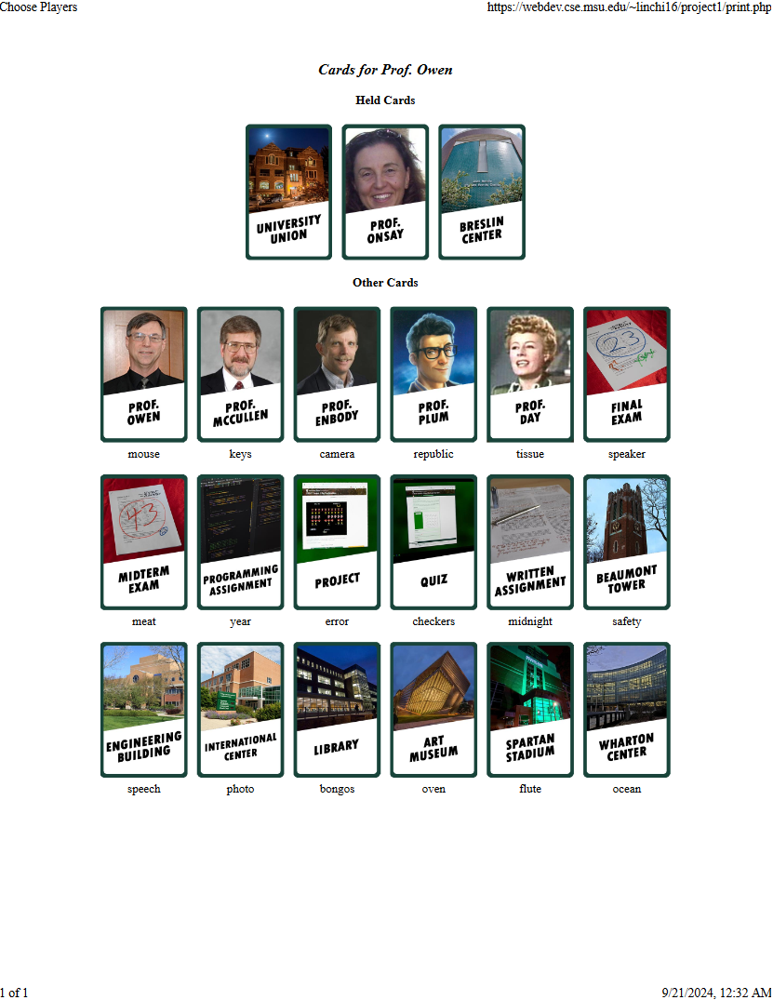
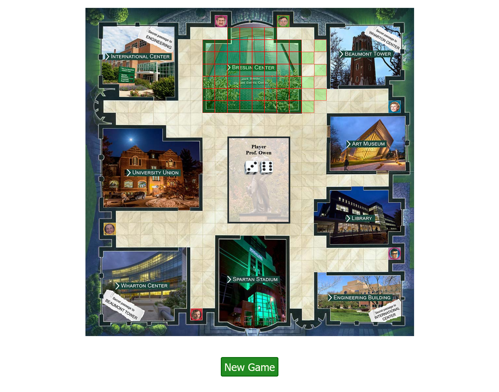

# Who Murdered My Grade? I

[Back to Home](../../../README.md).

Associated with Michigan State University.

Feb. 2020 ~ Mar. 2020

This was a course project from CSE477 Web Application Development at MSU. We utilized PHP7.0 for building this single page board game, which could be played by multiple players on a rotating basis. MVC (Model-View-Controller) pattern was used to reduce the complexity of the program and help distribute the workload to team members. And, PHPUnit was used for unit testing. The project was developed under scrum project management.

## Project Link

[Link](https://webdev.cse.msu.edu/~linchi16/project1/)

## Screenshots

