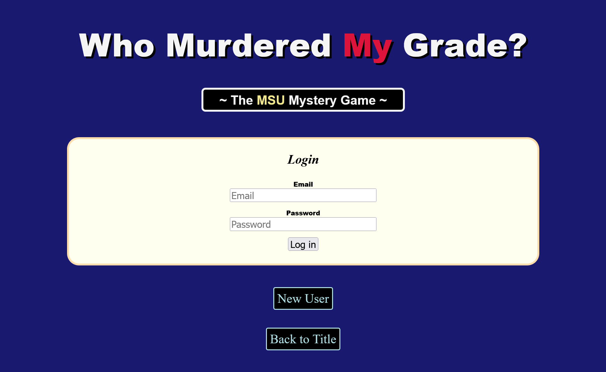

# Who Murdered My Grade? II

[Back to Home](../../../README.md).

Associated with Michigan State University.

Mar. 2020 ~ Apr. 2020

This was a course project from CSE477 Web Application Development at MSU, and it was the extension of the previous project "Who Murdered My Grade? I". The work devoted to it was to enable the system to handle multiple players to play in a game with their own devices, which were connected to the remote server, and to handle multiple rooms to have multiple groups of players playing the game at the same time. We built the login control to have users create their own account, verify it, and log in to the account. We also built the game-room system to provide users with the lobby, waiting room, and gaming room. Furthermore, we adopted Ratchet for having WebSockets to push notifications to players in the same room after any changes made.

## Project Link

[Link](https://webdev.cse.msu.edu/~linchi16/project2/)

## Screenshots

